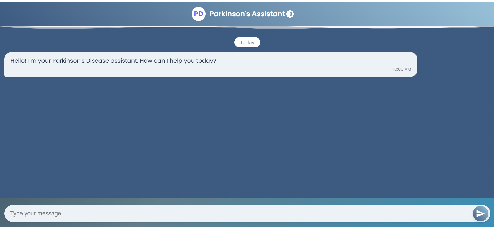

# Parkinson's Chatbot

## Project Overview
The **Parkinson's Chatbot** is a web application that allows users to interact with a chatbot designed to provide information and guidance related to Parkinson’s disease. The frontend is built using **HTML, CSS, and JavaScript**, and the chatbot interface is fully interactive within the web page.  

Users can:
- Ask questions related to Parkinson’s disease.
- Receive instant responses from the chatbot.
- Interact with a simple and user-friendly interface.

The entire code is in **one file**: `index.html`. An example output is provided below.

---

## Features
- Interactive chatbot interface using HTML, CSS, and JavaScript.
- Instant responses for user queries about Parkinson’s disease.
- User-friendly design for easy navigation.
- Entire project contained in a single HTML file for easy deployment.

---

## Technologies Used
- HTML5
- CSS3
- JavaScript (Vanilla JS)

---

## How to Use
1. Open `index.html` in any modern browser.
2. Type your question in the input box at the bottom of the chatbot interface.
3. Press **Enter** or click the **Send** button.
4. The chatbot will respond with relevant information or guidance.

---

## Example Output

The chatbot interface displays user messages and bot responses interactively.

---

## License
This project is open-source and free to use for educational purposes.
